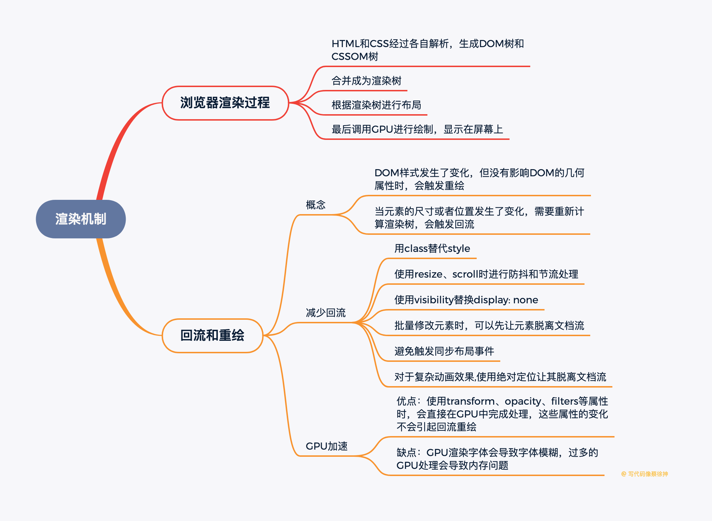
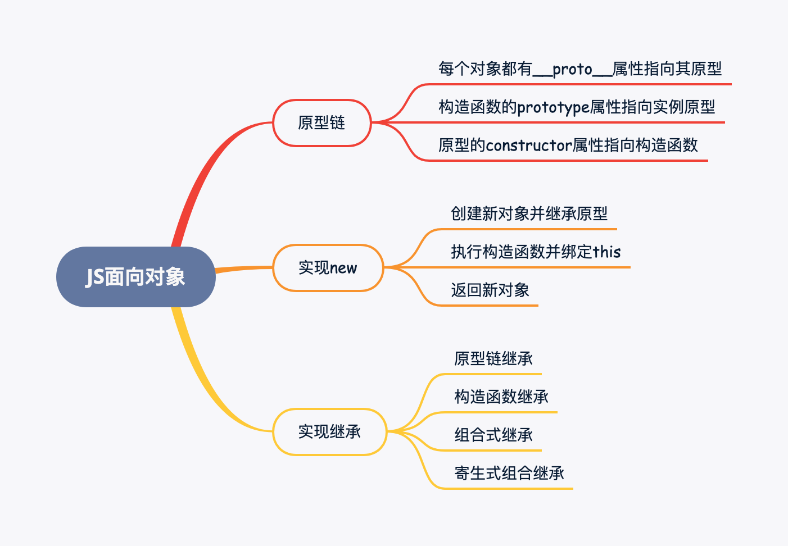
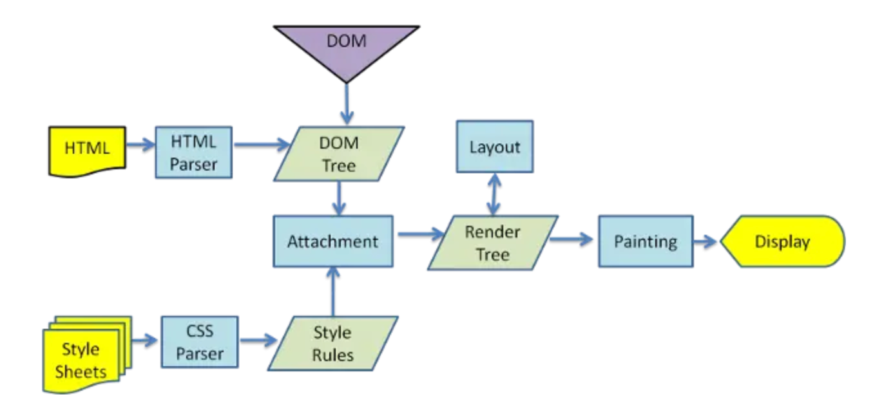
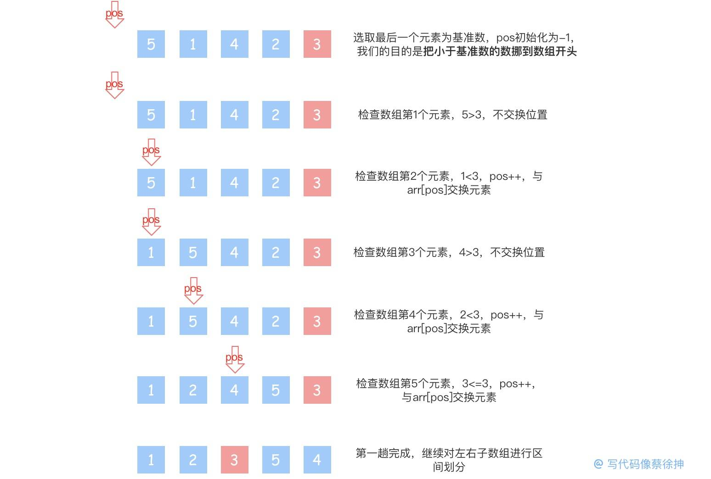
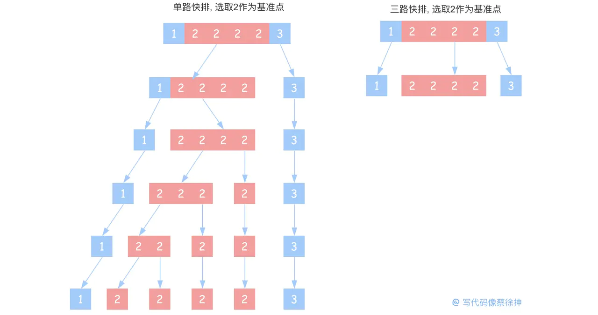
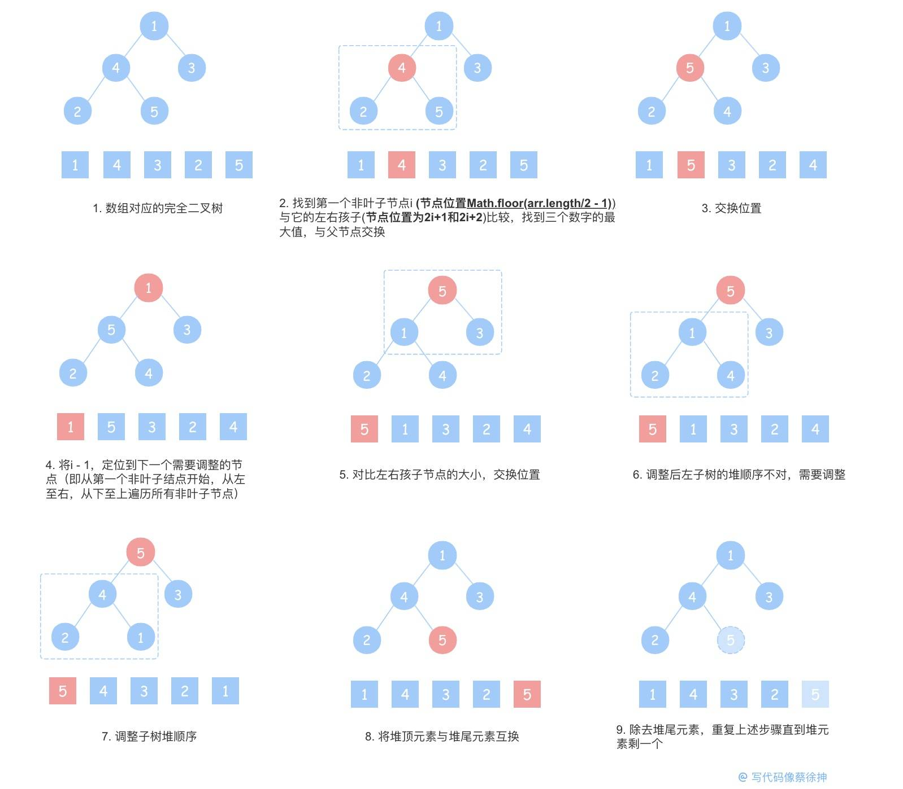

# js基础
## 手写call
```js
//call() 方法使用一个指定的 this 值和单独给出的一个或多个参数来调用一个函数
//语法：function.call(thisArg, arg1, arg2, ...)
```
call()的原理比较简单，由于函数的this指向它的直接调用者，我们变更调用者即完成this指向的变更：
```js
变更函数调用者示例
function foo() {
console.log(this.name)
}

// 测试
const obj = {
name: '手写call'
}
obj.foo = foo   // 变更foo的调用者
obj.foo()       // '手写call'

复制代码基于以上原理, 我们两句代码就能实现call()
Function.prototype.myCall = function(thisArg, ...args) {
	thisArg.fn = this              // this指向调用call的对象,即我们要改变this指向的函数
	return thisArg.fn(...args)     // 执行函数并return其执行结果
}
```

```js
//补充
Function.prototype.CjcCall=function (thisArgs,...args){
  const fn = Symbol('fn')
  thisArgs = thisArgs || window //为传入对象则指向window
  thisArgs[fn] = this
  const result = thisArgs[fn](...args)
  delete thisArgs[fn]
  return result
}

function a(){
  console.log(this.a)
}
obj={
  a:'aaaaaaaaaa'
}
a.CjcCall(obj)
```
## 2手写apply
```js
//apply() 方法调用一个具有给定this值的函数，以及作为一个数组（或类似数组对象）提供的参数。
//语法：func.apply(thisArg, [argsArray])
```


apply()和call()类似，区别在于call()接收参数列表，而apply()接收一个参数数组，所以我们在call()的实现上简单改一下入参形式即可
```js
Function.prototype.CjcApply = function (thisArgs,args){
  const fn = Symbol('fn')
  thisArgs = thisArgs || window
  thisArgs[fn] = this
  let result = thisArgs[fn](...args)
  delete thisArgs[fn]
  return result
}
function a(){
  console.log(this.a)
}
obj={
  a:'aaaaaaaaaa'
}
a.CjcApply(obj,['adadadadass'])
```

## 3手写bind(arguments?)

bind() 方法创建一个新的函数，在 bind() 被调用时，这个新函数的 this 被指定为 bind() 的第一个参数，而其余参数将作为新函数的参数，供调用时使用。
语法: function.bind(thisArg, arg1, arg2, ...)

```js
// 从用法上看，似乎给call/apply包一层function就实现了bind()：
Function.prototype.myBind = function(thisArg, ...args) {
return () => {
this.apply(thisArg, args)
}
}
```
复制代码但我们忽略了三点：

- bind()除了this还接收其他参数，bind()返回的函数也接收参数，这两部分的参数都要传给返回的函数
- new会改变this指向：如果bind绑定后的函数被new了，那么this指向会发生改变，指向当前函数的实例
- 没有保留原函数在原型链上的属性和方法
```js

Function.prototype.CjcBind = function (thisArgs,...args){
  let self = this
  let fn = function (){
     self.apply(thisArgs instanceof self ? this:thisArgs,args.concat(Array.prototype.splice.call(arguments)))
  }
  fn.prototype = Object.create(self.prototype);
  return fn
}
function c(a,b){
  console.log(arguments,a,b)
}
obj={}
c.CjcBind(obj, 'adadad', 'dasdasdasd')('aaaa','asdasds')
```
## 4 防抖函数
防抖，即短时间内大量触发同一事件，只会执行一次函数，实现原理为设置一个定时器，约定在xx毫秒后再触发事件处理，每次触发事件都会重新设置计时器，直到xx毫秒内无第二次操作，防抖常用于搜索框/滚动条的监听事件处理，如果不做防抖，每输入一个字/滚动屏幕，都会触发事件处理，造成性能浪费
```js
function debounce(fn,time){
  let timeout = null
  return function (){
    let that = this
    let args = arguments
    if (timeout) clearTimeout(timeout)
    timeout = setTimeout(()=>{
        fn.apply(that, args)
      },time)
  }
}
const debounced = debounce(()=>console.log('hi'),1000)
debounced()
```
## 5 节流函数

防抖是延迟执行，而节流是间隔执行，函数节流即每隔一段时间就执行一次，实现原理为设置一个定时器，约定xx毫秒后执行事件，如果时间到了，那么执行函数并重置定时器，和防抖的区别在于，防抖每次触发事件都重置定时器，而节流在定时器到时间后再清空定时器

```js
function throttle(fn,time){
  let timeout = null
  return function (){
    let that = this
    let args = arguments
    if (!timeout){
      timeout = setTimeout(()=>{
        console.log(1)
        timeout = null
        fn.apply(that, args)
      },time)
    }
  }
}
/*******************************************************************************************************/
// function throttle(func, wait) {
//   var prev = 0;
//   return function() {
//     let now = Date.now();
//     let context = this;
//     let args = arguments;
//     if (now - prev > wait) {
//       func.apply(context, args);
//       prev = now;
//     }
//   }
// }
const throttled = throttle(()=>console.log('hi'),1000)
throttled()
throttled()
throttled()
throttled()
```
## 6 数组扁平化
```js
let arr = [1, [1,2], [1,2,3]]
```
- 1 es6 =》 flat
```js
console.log(arr.flat());  // [1, 1, 2, 1, 2, 3]
```

- 2 递归(for,reduce)
```js
function flat(arr){
let result = result || []
for (let item of arr){
item instanceof Array ? result.concat(item):result.push(item)
}
return result
}
const arr = [1, [1,2], [1,2,3]]
function flat(arr) {
return arr.reduce((prev, cur) => {
return prev.concat(cur instanceof Array ? flat(cur) : cur)
}, [])
}

flat(arr)  // [1, 1, 2, 1, 2, 3]

console.log(arr.flat());  // [1, 1, 2, 1, 2, 3]

```

- 3 正则
```js
function flat(arr){
arr = JSON.stringify(arr);
const str = `[${JSON.stringify(arr).replace(/(\[|\])/g, '')}]`
JSON.parse(str)
}
console.log(arr.flat());  // [1, 1, 2, 1, 2, 3]
```

- 4 迭代+[...]
```js
let arr = [1, [1,2], [1,2,3,[4,4,4]]]
while (arr.some(Array.isArray)){
arr = [].concat(...arr);
}
console.log(arr)  // [1, 1, 2, 1, 2, 3]
```
## 7 promise

# js 面向对象
在JS中一切皆对象，但JS并不是一种真正的面向对象(OOP)的语言，因为它缺少类(class)的概念。虽然ES6引入了class和extends，使我们能够轻易地实现类和继承。但JS并不存在真实的类，JS的类是通过函数以及原型链机制模拟的，本小节的就来探究如何在ES5环境下利用函数和原型链实现JS面向对象的特性
在开始之前，我们先回顾一下原型链的知识，后续new和继承等实现都是基于原型链机制。很多介绍原型链的资料都能写上洋洋洒洒几千字，但我觉得读者们不需要把原型链想太复杂，容易把自己绕进去，其实在我看来，原型链的核心只需要记住三点：

- 每个对象都有__proto__属性，该属性指向其原型对象，在调用实例的方法和属性时，如果在实例对象上找不到，就会往原型对象上找
- 构造函数的prototype属性也指向实例的原型对象
- 原型对象的constructor属性指向构造函数

## 1. 模拟实现new
首先我们要知道new做了什么

- 创建一个新对象，并继承其构造函数的prototype，这一步是为了继承构造函数原型上的属性和方法
- 执行构造函数，方法内的this被指定为该新实例，这一步是为了执行构造函数内的赋值操作
- 返回新实例（规范规定，如果构造方法返回了一个对象，那么返回该对象，否则返回第一步创建的新对象）
## 2. ES5如何实现继承
说到继承，最容易想到的是ES6的extends，当然如果只回答这个肯定不合格，我们要从函数和原型链的角度上实现继承，下面我们一步步地、递进地实现一个合格的继承
1. 原型链继承 
   - 原型链继承的原理很简单，直接让子类的原型对象指向父类实例，当子类实例找不到对应的属性和方法时，就会往它的原型对象，
     也就是父类实例上找，从而实现对父类的属性和方法的继承
     ```js
        function Parent(){
          this.name = ['cjc']
        }
        Parent.prototype.getName =function () {
          console.log(this.name)
        }
        function Child(){}
        Child.prototype =new Parent()
        hild.prototype.constructor = Child
        // 然后Child实例就能访问到父类及其原型上的name属性和getName()方法
        const child = new Child()
        console.log(child.name);
        child.getName()
     ```
   - 由于所有Child实例原型都指向同一个Parent实例, 因此对某个Child实例的父类引用类型变量修改会影响所有的Child实例
     在创建子类实例时无法向父类构造传参, 即没有实现super()的功能
     ```js
       // 测试
      const child1 = new Child()
      const child2 = new Child()
      child1.name[0] = 'foo'
      console.log(child1.name)          // ['foo']
      console.log(child2.name)
     ```
2. 构造函数继承
   - 构造函数继承，即在子类的构造函数中执行父类的构造函数，并为其绑定子类的this，让父类的构造函数把成员属性和方法都挂到子类的this上去，这样既能避免实例之间共享一个原型实例，又能向父类构造方法传参
        ```js
            function Parent(){
              this.name = ['cjc']
            }
            Parent.prototype.getName =function () {
              console.log(this.name)
            }
            function Child(){
              Parent.call(this)
            }
            // // 测试
            const child1 = new Child()
            const child2 = new Child()
            child1.name[0] = 'foo'
            console.log(child1.name)          // ['foo']
            console.log(child2.name)
        ```
   - 构造函数继承的缺点: 继承不到父类原型上的属性和方法
3. 组合继承    
   - 既然原型链继承和构造函数继承各有互补的优缺点, 那么我们为什么不组合起来使用呢, 所以就有了综合二者的组合式继承
     ```js
        function Parent(){
          this.name = ['cjc']
        }
        Parent.prototype.getName =function () {
        console.log(this.name)
        }
        function Child(){
          Parent.call(this)
        }
        Child.prototype =new Parent()
        Child.prototype.constructor = Child
        // // 测试
        const child1 = new Child()
        const child2 = new Child()
        child1.name[0] = 'foo'
        console.log(child1.name)          // ['foo']
        console.log(child2.name)
     ```
   - 组合式继承的缺点:每次创建子类实例都执行了两次构造函数(Parent.call()和new Parent())，虽然这并不影响对父类的继承，
     但子类创建实例时，原型中会存在两份相同的属性和方法，这并不优雅
4. 寄生式组合继承
    - 为了解决构造函数被执行两次的问题, 我们将指向父类实例改为指向父类原型, 减去一次构造函数的执行
    ```js
      function Parent(name) {
        this.name = [name]
      }
      Parent.prototype.getName = function() {
        return this.name
      }
      function Child() {
      // 构造函数继承
        Parent.call(this, 'zhangsan')
      }
      //原型链继承
      // Child.prototype = new Parent()
      Child.prototype = Parent.prototype  //将`指向父类实例`改为`指向父类原型`
      Child.prototype.constructor = Child
      
      //测试
      const child1 = new Child()
      const child2 = new Child()
      child1.name[0] = 'foo'
      console.log(child1.name)          // ['foo']
      console.log(child2.name)          // ['zhangsan']
      child2.getName() 
   ```
   - 但这种方式存在一个问题，由于子类原型和父类原型指向同一个对象，我们对子类原型的操作会影响到父类原型，例如给Child.prototype增加一个getName()方法，那么会导致Parent.prototype也增加或被覆盖一个getName()方法，为了解决这个问题，我们给Parent.prototype做一个浅拷贝
   ```js
    function Parent(name) {
      this.name = [name]
    }
    Parent.prototype.getName = function() {
      return this.name
    }
    function Child() {
    // 构造函数继承
      Parent.call(this, 'zhangsan')
    }
    //原型链继承
    // Child.prototype = new Parent()
    Child.prototype = Object.create(Parent.prototype)  //将`指向父类实例`改为`指向父类原型`
    Child.prototype.constructor = Child
    
    //测试
    const child1 = new Child()
    const child2 = new Child()
    child1.name[0] = 'foo'
    console.log(child1.name)          // ['foo']
    console.log(child2.name)          // ['zhangsan']
    child2.getName() 
   ```
   - 到这里我们就完成了ES5环境下的继承的实现，这种继承方式称为寄生组合式继承，是目前最成熟的继承方式，babel对ES6继承的转化也是使用了寄生组合式继承
   - 我们回顾一下实现过程： 
        - 开始最容易想到的是原型链继承，通过把子类实例的原型指向父类实例来继承父类的属性和方法，但原型链继承的缺陷在于对子类实例继承的引用类型的修改会影响到所有的实例对象以及无法向父类的构造方法传参。
        - 因此我们引入了构造函数继承, 通过在子类构造函数中调用父类构造函数并传入子类this来获取父类的属性和方法，但构造函数继承也存在缺陷，构造函数继承不能继承到父类原型链上的属性和方法。
        - 所以我们综合了两种继承的优点，提出了组合式继承，但组合式继承也引入了新的问题，它每次创建子类实例都执行了两次父类构造方法，我们通过将子类原型指向父类实例改为子类原型指向父类原型的浅拷贝来解决这一问题，也就是最终实现 —— 寄生组合式继承

    
# 浏览器渲染机制
## 1. 浏览器的渲染过程是怎样的


解析 =》 构建 =》 布局 =》 绘制 =》 回流 =》 重绘
1. 浏览器通过html parser和css parser将HTML和style sheets 解析成DOM Tree和CSS Rule Tree ，
2. 根据DOM Tree和CSS Rule Tree生成Render Tree，将一些不需要展示的元素移除（display：none;head）
3. 根据Render Tree中的规则计算元素在页面出现的位置以及各节点元素的css样式
4. Gpu根据规则将内容显示在屏幕上
5. 节点的元素位置大小发生改变时需要到倒回去重新绘制
6. 改变某个元素的背景色、文字颜色、边框颜色等等不影响它周围或内部布局的属性时，屏幕的一部分要重画，但是元素的几何尺寸没有变

## 2. 如何根据浏览器渲染机制加快首屏速度
1. 优化文件大小：HTML和CSS的加载和解析都会阻塞渲染树的生成，从而影响首屏展示速度，因此我们可以通过优化文件大小、减少CSS文件层级的方法来加快首屏速度
2. 避免资源下载阻塞文档解析：浏览器解析到script标签时，会阻塞文档解析，直到脚本执行完成， 因此我们通常把script标签放在底部，或者加上defer、async来进行异步下载

## 3. 什么是回流(重排)，什么情况下会触发回流
- 当元素的尺寸或者位置发生了变化，就需要重新计算渲染树，这就是回流
- DOM元素的几何属性(width/height/padding/margin/border)发生变化时会触发回流
- DOM元素移动或增加会触发回流
- 读写offset/scroll/client等属性时会触发回流
- 调用window.getComputedStyle会触发回流

## 4. 什么是重绘，什么情况下会触发重绘
- DOM样式发生了变化，但没有影响DOM的几何属性时，会触发重绘，而不会触发回流。重绘由于DOM位置信息不需要更新，省去了布局过程，因而性能上优于回流

## 5. 什么是GPU加速，如何使用GPU加速，GPU加速的缺点

- 优点：使用transform、opacity、filters等属性时，会直接在GPU中完成处理，这些属性的变化不会引起回流重绘
- 缺点：GPU渲染字体会导致字体模糊，过多的GPU处理会导致内存问题
## 6. 如何减少回流

- 使用class替代style，减少style的使用
- 使用resize、scroll时进行防抖和节流处理，这两者会直接导致回流
- 使用visibility替换display: none，因为前者只会引起重绘，后者会引发回流
- 批量修改元素时，可以先让元素脱离文档流，等修改完毕后，再放入文档流
- 避免触发同步布局事件，我们在获取offsetWidth这类属性的值时，可以使用变量将查询结果存起来，避免多次查询，每次对offset/scroll/client等属性进行查询时都会触发回流
- 对于复杂动画效果,使用绝对定位让其脱离文档流，复杂的动画效果会频繁地触发回流重绘，我们可以将动画元素设置绝对定位从而脱离文档流避免反复回流重绘。

# 排序算法
## 1. 手写冒泡排序

冒泡排序应该是很多人第一个接触的排序，比较简单，不展开讲解了

```js
function bubbleSort(arr){
for(let i = 0; i < arr.length; i++) {
  for(let j = 0; j < arr.length - i - 1; j++) {
    if(arr[j] > arr[j+1]) {
      let temp = arr[j]
      arr[j] = arr[j+1]
      arr[j+1] = temp
    }
  }
}
return arr
}
```

## 2. 如何优化一个冒泡排序

冒泡排序总会执行(N-1)+(N-2)+(N-3)+..+2+1趟，但如果运行到当中某一趟时排序已经完成，或者输入的是一个有序数组，那么后边的比较就都是多余的，为了避免这种情况，我们增加一个flag，判断排序是否在中途就已经完成（也就是判断有无发生元素交换）
```js
function bubbleSort(arr){
  for(let i = 0; i < arr.length; i++) {
    let flag = true
    for(let j = 0; j < arr.length - i - 1; j++) {
      if(arr[j] > arr[j+1]) {
        flag = false
        let temp = arr[j]
        arr[j] = arr[j+1]
        arr[j+1] = temp
      }
    }
    // 这个flag的含义是：如果`某次循环`中没有交换过元素，那么意味着排序已经完成
    if(flag)  break;
  }
  return arr
}
```
## 3. 手写快速排序

快排基本步骤：


- 选取基准元素
- 比基准元素小的元素放到左边，大的放右边
- 在左右子数组中重复步骤一二，直到数组只剩下一个元素
- 向上逐级合并数组

```js
function quickSort(arr) {
    if(arr.length <= 1) return arr          //递归终止条件
    const pivot = arr.length / 2 | 0        //基准点
    const pivotValue = arr.splice(pivot, 1)[0]
    const leftArr = []
    const rightArr = []
    arr.forEach(val => {
        val > pivotValue ? rightArr.push(val) : leftArr.push(val)
    })
    return [ ...quickSort(leftArr), pivotValue, ...quickSort(rightArr)]
}

```
## 4. 如何优化一个快速排序

原地排序

上边这个快排只是让读者找找感觉，我们不能这样写快排，如果每次都开两个数组，会消耗很多内存空间，数据量大时可能造成内存溢出，我们要避免开新的内存空间，即原地完成排序
我们可以用元素交换来取代开新数组，在每一次分区的时候直接在原数组上交换元素，将小于基准数的元素挪到数组开头，以[5,1,4,2,3]为例：

我们定义一个pos指针, 标识等待置换的元素的位置, 然后逐一遍历数组元素, 遇到比基准数小的就和arr[pos]交换位置, 然后pos++

代码实现：
```js
function quickSort(arr, left, right) {          //这个left和right代表分区后“新数组”的区间下标，因为这里没有新开数组，所以需要left/right来确认新数组的位置
    if (left < right) {
        let pos = left - 1                      //pos即“被置换的位置”，第一趟为-1
        for(let i = left; i <= right; i++) {    //循环遍历数组，置换元素
            let pivot = arr[right]              //选取数组最后一位作为基准数，
            if(arr[i] <= pivot) {               //若小于等于基准数，pos++，并置换元素, 这里使用小于等于而不是小于, 其实是为了避免因为重复数据而进入死循环
                pos++
                let temp = arr[pos]
                arr[pos] = arr[i]
                arr[i] = temp
            }
        }
        //一趟排序完成后，pos位置即基准数的位置，以pos的位置分割数组
        quickSort(arr, left, pos - 1)        
        quickSort(arr, pos + 1, right)
    }
    return arr      //数组只包含1或0个元素时(即left>=right)，递归终止
}

//使用
var arr = [5,1,4,2,3]
var start = 0;
var end = arr.length - 1;
quickSort(arr, start, end)
```
复制代码这个交换的过程还是需要一些时间理解消化的，详细分析可以看这篇：js算法-快速排序(Quicksort)

三路快排

上边这个快排还谈不上优化，应当说是快排的纠正写法，其实有两个问题我们还能优化一下：

有序数组的情况：如果输入的数组是有序的，而取基准点时也顺序取，就可能导致基准点一侧的子数组一直为空, 使时间复杂度退化到O(n2)
大量重复数据的情况：例如输入的数据是[1,2,2,2,2,3], 无论基准点取1、2还是3, 都会导致基准点两侧数组大小不平衡, 影响快排效率

对于第一个问题, 我们可以通过在取基准点的时候随机化来解决，对于第二个问题，我们可以使用三路快排的方式来优化，比方说对于上面的[1,2,2,2,2,3]，我们基准点取2，在分区的时候，将数组元素分为小于2|等于2|大于2三个区域，其中等于基准点的部分不再进入下一次排序, 这样就大大提高了快排效率

## 5. 手写归并排序

归并排序和快排的思路类似，都是递归分治，区别在于快排边分区边排序，而归并在分区完成后才会排序

[comment]: <> (![img.png]&#40;img/img_6.png&#41;)
```js
function mergeSort(arr) {
    if(arr.length <= 1) return arr		//数组元素被划分到剩1个时，递归终止
    const midIndex = arr.length/2 | 0
    const leftArr = arr.slice(0, midIndex)
    const rightArr = arr.slice(midIndex, arr.length)
    return merge(mergeSort(leftArr), mergeSort(rightArr))	//先划分，后合并
}

//合并
function merge(leftArr, rightArr) {
    const result = []
    while(leftArr.length && rightArr.length) {
    	leftArr[0] <= rightArr[0] ? result.push(leftArr.shift()) : result.push(rightArr.shift())
    }
    while(leftArr.length) result.push(leftArr.shift())
    while(rightArr.length) result.push(rightArr.shift())
    return result
}

```

## 6. 手写堆排序

堆是一棵特殊的树, 只要满足这棵树是完全二叉树和堆中每一个节点的值都大于或小于其左右孩子节点这两个条件, 那么就是一个堆, 根据堆中每一个节点的值都大于或小于其左右孩子节点, 又分为大根堆和小根堆

堆排序的流程：

初始化大(小)根堆，此时根节点为最大(小)值，将根节点与最后一个节点(数组最后一个元素)交换
除开最后一个节点，重新调整大(小)根堆，使根节点为最大(小)值
重复步骤二，直到堆中元素剩一个，排序完成

以[1,5,4,2,3]为例构筑大根堆：

代码实现：
```js
// 堆排序
const heapSort = array => {
        // 我们用数组来储存这个大根堆,数组就是堆本身
	// 初始化大顶堆，从第一个非叶子结点开始
	for (let i = Math.floor(array.length / 2 - 1); i >= 0; i--) {
		heapify(array, i, array.length);
	}
	// 排序，每一次 for 循环找出一个当前最大值，数组长度减一
	for (let i = Math.floor(array.length - 1); i > 0; i--) {
		// 根节点与最后一个节点交换
		swap(array, 0, i);
		// 从根节点开始调整，并且最后一个结点已经为当前最大值，不需要再参与比较，所以第三个参数为 i，即比较到最后一个结点前一个即可
		heapify(array, 0, i);
	}
	return array;
};

// 交换两个节点
const swap = (array, i, j) => {
	let temp = array[i];
	array[i] = array[j];
	array[j] = temp;
};

// 将 i 结点以下的堆整理为大顶堆，注意这一步实现的基础实际上是：
// 假设结点 i 以下的子堆已经是一个大顶堆，heapify 函数实现的
// 功能是实际上是：找到 结点 i 在包括结点 i 的堆中的正确位置。
// 后面将写一个 for 循环，从第一个非叶子结点开始，对每一个非叶子结点
// 都执行 heapify 操作，所以就满足了结点 i 以下的子堆已经是一大顶堆
const heapify = (array, i, length) => {
	let temp = array[i]; // 当前父节点
	// j < length 的目的是对结点 i 以下的结点全部做顺序调整
	for (let j = 2 * i + 1; j < length; j = 2 * j + 1) {
		temp = array[i]; // 将 array[i] 取出，整个过程相当于找到 array[i] 应处于的位置
		if (j + 1 < length && array[j] < array[j + 1]) {
			j++; // 找到两个孩子中较大的一个，再与父节点比较
		}
		if (temp < array[j]) {
			swap(array, i, j); // 如果父节点小于子节点:交换；否则跳出
			i = j; // 交换后，temp 的下标变为 j
		} else {
			break;
		}
	}
}

```
其实从表格中我们可以看到，就时间复杂度而言，快排并没有很大优势，然而为什么快排会成为最常用的排序手段，这是因为时间复杂度只能说明随着数据量的增加，算法时间代价增长的趋势，并不直接代表实际执行时间，实际运行时间还包括了很多常数参数的差别，此外在面对不同类型数据(比如有序数据、大量重复数据)时，表现也不同，综合来说，快排的时间效率是最高的
在实际运用中, 并不只使用一种排序手段, 例如V8的Array.sort()就采取了当 n<=10 时, 采用插入排序, 当 n>10 时，采用三路快排的排序策略

## 7. 归并、快排、堆排有何区别


```
排序        时间复杂度(最好情况)  时间复杂度(最坏情况)      空间复杂度      稳定性
快速排序       O(nlogn)            O(n^2)            O(logn)~O(n)      不稳定
归并排序       O(nlogn)            O(nlogn)            O(n)            稳定
堆排序         O(nlogn)            O(nlogn)            O(1)            不稳定
```
# 设计模式
设计模式有许多种，这里挑出几个常用的：


```js
设计模式        描述                  例子

- 单例模式      一个类只能构造出唯一实例                    Redux/Vuex的store
- 工厂模式      对创建对象逻辑的封装                      jQuery的$(selector)
- 观察者模式    当一个对象被修改时，会自动通知它的依赖对象    Redux的subscribe、Vue的双向绑定
- 装饰器模式    对类的包装，动态地拓展类的功能               React高阶组件、ES7 装饰器
- 适配器模式    兼容新旧接口，                              对类的包装 封装旧API
- 代理模式      控制对象的访问                             事件代理、ES6的Proxy
```


## 1. 介绍一下单一职责原则和开放封闭原则


- 单一职责原则：一个类只负责一个功能领域中的相应职责，或者可以定义为：就一个类而言，应该只有一个引起它变化的原因。


- 开放封闭原则：核心的思想是软件实体（类、模块、函数等）是可扩展的、但不可修改的。也就是说,对扩展是开放的,而对修改是封闭的。

## 2. 单例模式
单例模式即一个类只能构造出唯一实例，单例模式的意义在于共享、唯一，Redux/Vuex中的store、JQ的$或者业务场景中的购物车、登录框都是单例模式的应用
```js
class SingletonLogin {
  constructor(name,password){
    this.name = name
    this.password = password
  }
  static getInstance(name,password){
    //判断对象是否已经被创建,若创建则返回旧对象
    if(!this.instance)this.instance = new SingletonLogin(name,password)
    return this.instance
  }
}
 
let obj1 = SingletonLogin.getInstance('CXK','123')
let obj2 = SingletonLogin.getInstance('CXK','321')
 
console.log(obj1===obj2)    // true
console.log(obj1)           // {name:CXK,password:123}
console.log(obj2)           // 输出的依然是{name:CXK,password:123}

```
## 3. 工厂模式
   工厂模式即对创建对象逻辑的封装，或者可以简单理解为对new的封装，这种封装就像创建对象的工厂，故名工厂模式。工厂模式常见于大型项目，比如JQ的$对象，我们创建选择器对象时之所以没有new selector就是因为$()已经是一个工厂方法，其他例子例如React.createElement()、Vue.component()都是工厂模式的实现。工厂模式有多种：简单工厂模式、工厂方法模式、抽象工厂模式，这里只以简单工厂模式为例：
```js
class User {
  constructor(name, auth) {
    this.name = name
    this.auth = auth
  }
}

class UserFactory {
  static createUser(name, auth) {
    //工厂内部封装了创建对象的逻辑:
    //权限为admin时,auth=1, 权限为user时, auth为2
    //使用者在外部创建对象时,不需要知道各个权限对应哪个字段, 不需要知道赋权的逻辑，只需要知道创建了一个管理员和用户
    if(auth === 'admin')  new User(name, 1)
    if(auth === 'user')  new User(name, 2)
  }
}

const admin = UserFactory.createUser('cxk', 'admin');
const user = UserFactory.createUser('cxk', 'user');

```

内容来源：写代码像蔡徐抻 链接：https://juejin.cn/post/6844904116552990727


